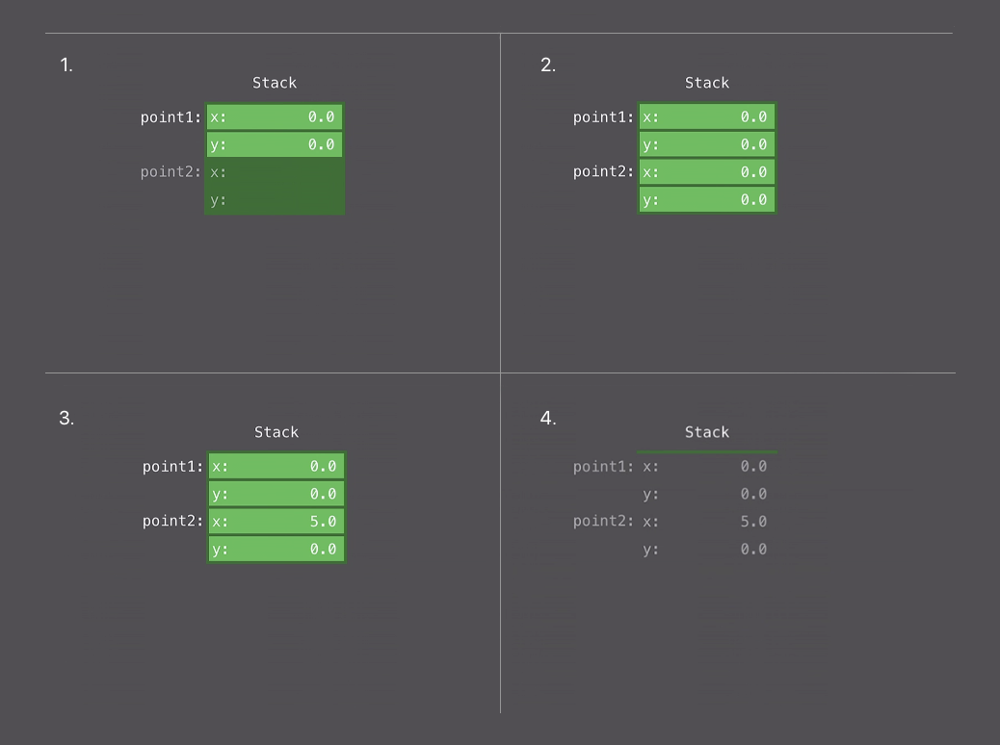
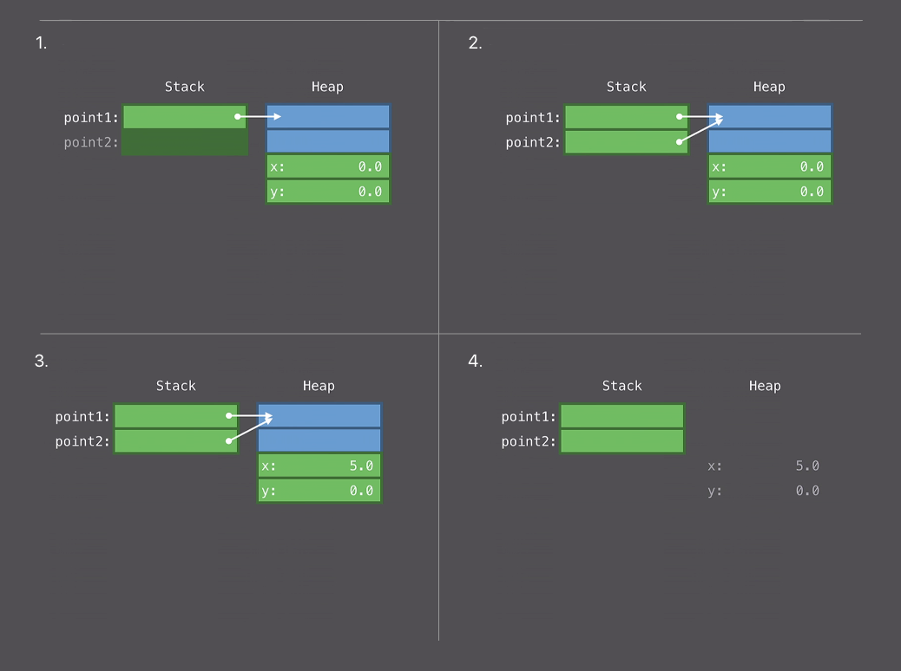

Небольшое отступление:
+ Данный материал является пересказом(расширенным переводом? комментированным переводом? примечательным переводом?) [презентации](https://developer.apple.com/videos/play/wwdc2016/416/) WWDC 2016
+ Вопреки частому мнению о том, что вещи под капотом должны там и оставаться, иногда крайне полезно разобраться что же там происходит. Это поможет использовать предмет правильно и по назначению

Цель:
Дать поверхностное представление о слабых местах ООП. Объяснить как работает Протокольно-Ориентирвоанное Программирование в Swift, и как заместить им ООП.

Начало материала:
В данном материале будут затронуты ключевые проблемы Объектно-ориентированного программирования и то как Протокольно-ориентированное программирование их решает. Всё будет рассматриваться в реалиях языка **Swift**, в подробностях будет рассмотрена "подкапотная" работы протоколов.

К делу:
### Проблемы ООП и зачем нам нужно ПОП
Известно, что в ОПП существует ряд слабых мест, которые способны "перегрузить" выполнение программы. Рассмотрим наиболее явные и часто встречаемые:

##### Q: Что по поводу языка? Вещи типа heap переводить в кучу? Думаю нет, а если так, то и вовсе не стоит

##### 1. Allocation (аллокация)
Stack или Heap?

##### 2. Reference counting (Подсчет ссылок)
Больше или меньше? // TODO: Не нравится

##### 3. Method dispatch (отправка метода?)
Статическая или динамическая?

### 1. Allocation - Stack
Stack это довольно простая и примитивная структура данных. Мы можем положить на вершину stack-а (push), можем взять с вершины stack-а (pop). Простота заключается в том, что это все, что мы можем делать со стэком.

Для простоты картины положим, что у каждого стэка есть переменная (stack pointer). Она используется для отслеживания вершины стэка и хранит в себе целочисленное число (`Integer`). Из этого следует, что скорость операций со stack-ом равна скорости перезаписи `Integer`-а в эту переменную.

> push - кладем на вершину стэка, увеличиваем stack pointer
> pop - уменьшаем stack pointer

##### Типы значений
Рассмотрим принципы работы стэка в Swift используя структуры (`struct`).

> В Swift типами занчений являются *структуры* (`struct`) и *перечисления* (`enum`), а ссылочными типами являются *классы* (`class`) и *функции/замыкания* (`func`). Типы значений хранятся на стэке, ссылочные типы хранятся на хипе.

```swift
struct Point {
    var x, y: Double
    func draw() {...}
}

let point1 = Point(...) // (1)

let point2 = point1     // (2)

point2.x = 5            // (3)

// используем point1
// используем point2

// (4)
```



1. Размещаем первую структуру на Stack-е
2. Копируем содержимое первой структуры
3. Изменяем память второй структуры (первая остается не тронутой)
4. Конец использования. Освобождение памяти

### 1. Allocation - Heap
Heap - это древовидная структура данных. Тема реализации heap здесь затронута не будет, но мы попытаемся сравнить её со стэком.
Почему, если это возможно, стоит использовать стэк вместо хип? Вот почему:
+ Подсчет ссылок
+ Администрация свободной памяти и ее поиск для аллокации // TODO: Management
+ Перезапись памяти для деалокации

Всё это - лишь малая часть того, что обеспечивает работу heap-а и явно оттягащает его в сравнении со стэком. 
Например когда нам нужна свободная память на стэке, мы просто берем значение stack-pointer-а и увеличиваем его (ведь всё, что выше stack-pointer-а, в стэке, является свободной памятью) - O(1), операция постоянна по времени. 
Когда нам нужна свободная память на хипе, то мы начинаем её искать при помощи соответствующего алгоритма поиска в древовидной структуре данных - в лучшем случае O(logn), операция не постоянна по времени и зависит от конкретных реализаций.

> На самом деле хип намного сложнее, его работу обеспечивает ещё масса других механизмов, которые обитают в недрах операционных систем.

Также стоит отметить, что использование кучи в режиме мультипоточности ухудшает ситуацию в разы, так как необходимо обеспечить синхронизацию разделяемого ресурса (памяти) для разных потоков. Достигается при помощи использования [Блокировки](https://ru.wikipedia.org/wiki/%D0%91%D0%BB%D0%BE%D0%BA%D0%B8%D1%80%D0%BE%D0%B2%D0%BA%D0%B0_(%D0%BF%D1%80%D0%BE%D0%B3%D1%80%D0%B0%D0%BC%D0%BC%D0%B8%D1%80%D0%BE%D0%B2%D0%B0%D0%BD%D0%B8%D0%B5)) (семафоры, спинлоки и т.п.).

##### Ссылочные типы
Рассмотрим принцип работы хипа в Swift используя классы (`class`).

```swift
class Point {
    var x, y: Double
    func draw() {...}
}

let point1 = Point(...) // (1)

let point2 = point1     // (2)

point2.x = 5            // (3)

// используем point1
// используем point2

// (4)
```



1. Размещаем тело класса на Heap-е. Размещаем указатель на это тело на Stack-е
2. Копируем указатель, который ссылается на тело класса
3. Изменяем тело класса
4. Конец использлвания. Освобождение памяти

### 1. Allocation - Небольшой и "Реальный" пример

В некоторых ситуациях выбор в пользу stack-а не только упрощает работу с памятью, но и улучшает качество кода. Рассмотрим на примере:
```swift
enum Color { case red, green, blue }
enum Orientation { case left, right }
enum Tail { case none, tail, bubble }

var cache: [String: UIImage] = []

func makeBalloon(_ color: Color, _ orientation: Orientation, _ tail: Tail) -> UIImage {
    let key = "\(color):\(orientation):\(tail)"
    if let image = cache[key] {
        return image
    }
    ...
}
```
Если в словаре `cache` есть значение с ключом `key`, то функция просто вернет закешированный `UIImage`

Проблемы этого кода:
+ Не лучшей практикой является использование `String` как ключа в `cached`, ведь `String` в конце концов "может оказаться чем-угодно".
+ `String` - это copy-on-write структура, для реализации ее динамичности все свои `Character`-ы она хранит на Heap-е. Таким образом `String` - это структура и хранится в Stack-е, но все свое содержимое она хранит на Heap-е.

> Это необхоидмо для того, чтобы обеспечить возможность изменения строки (убрать часть строки, добавить новую строку к этой строке). Если бы все символы строки хранились на стэке, то такие манипуляции были бы невозможными. Например в C строки - статические, а это значит что размер строки невозможно увеличить в runtime т.к. всё содержимое хранится на Stack-е. Про copy-on-write и более детальный разбор строк в Swift можно обратиться [сюда](https://developer.apple.com/documentation/swift/string)

Решение:
1. Использовать вместо строки вполне очевидную здесь структуру:
```swift
struct Attributes: Hashable {
    var color: Color
    var orientation: Orientation
    var tail: Tail
}
```

2. Изменить словарь на:
```swift
var cache: [Attributes: UIImage] = []
```

3. Избавиться от `String`:
```swift
let key = Attributes(color: color, orientation: orientation, tail: tail)
```

В структуре `Attributes` все свойства хранятся на Stack-е, так как перечисление (`enum`) хранится на Stack-е. Значит, что никакого неявного использования Heap здесь нет и теперь ключи для словаря cache предельно точно определены, что увеличило безопасность и ясность этого кода. Также мы избавились от неявного использования хипа.

##### Вердикт
Стэк гораздо легче и быстрее кучи - выбор для большинства ситуаций очевиден

### 2. Reference counting

###### Для чего?
Swift должен знать, когда можно освободить фрагмент памяти на хипе, занятый, например, инстансом класса или функции. Реализовано это через механизм подсчета ссылок - у каждого размещенного на хипе инстанса (класса или функции) есть переменная, которая хранит количество ссылок на него. Когда на инстанс нет ссылок, то Swift решает осовободить фрагмент памяти, выделенный под него.

Следует отметить, что для "качественной" реализации этого механизма необходимо гораздо больше ресурсов, чем для увеличение и уменьшение Stack-pointer-а. Это обусловленно тем, что значение количества ссылок может увеличиваться из разных потоков (т.к. ссылаться на класс или функцию можно из разных потоков). Также не стоит забывать про необходимость обеспечения синхронизации разделяемого ресурса (переменная количества ссылок) для разных потоков (спинлоки, семафоры и т.п.).

> Стэк: поиск свободной памяти и освобождение используемой - операция с stack-pointer-ом
> Хип: поиск свободной памяти и освобождение используемой - алгоритм поиска в дереве и reference counting

###### Псевдокод
Рассмотрим небольшой фрагмент псевдокода, для демонстрации работы подсчета ссылок:

```swift
class Point {
    var refCount: Int
    var x, y: Double
    func draw() {...}

    init(...) {
        ...
        self.refCount = 1
    }
}

let point1 = Point(x: 0, y: 0)
let point2 = point1
retain(point2) // retain() - увеличить refCount на 1 для соответствующего инстанса
point2.x = 5

// используем `point1`
release(point1) // release() - уменьшить refCount на 1

// используем `point2`
release(point2)
```

###### `struct`
При работе со структурами, такой механизм как reference counting просто не нужен:
1. `struct` не хранится на Heap-е
2. `struct` - **копируется** при присваивании, следовательно нет ссылок

###### Копирование ссылок
Снова, `struct`, и любые другие типы значений в Swift, копируются при присваивании. В случае, если структура хранит в себе ссылки, они также скопируются:
```swift
struct Label {
    let text: String
    let font: UIFont
    ...
    init() {
        ...
        text.refCount = 1
        font.refCount = 1
    }
}

let label = Label(text: "Hi", font: font)
let label2 = label
retain(label2.text._storage) // так как это `String` и она хранит свое содержимое на Heap
retain(label2.font)

// используем label
release(label.text._storage)
release(label.font)

// используем label2
release(label2.text._storage)
release(label2.font)
```

`label` и `label2` делят между собой общие инстансы, размещенные на хипе:
+ содержимое `text`
+ и `font`
Таким образом, если `struct` хранит в себе ссылки, то, при копировании этой структуры, количество ссылок удваивается, что, при остутствии необходимости, отрицательно сказывается на "легкости" программы.

###### И снова "реальный" пример

```swift
struct Attachment {
    let fileUrl: URL // ссылка на HEAP память
    let uuid: String // неявная ссылка на HEAP память
    let mimeType: String // неявная ссылка на HEAP память

    init?(fileUrl: URL, uuid: String, mimeType: String) {
        guard mimeType.isMimeType else {
            return nil
        }

        self.fileUrl = fileUrl
        self.uuid = uuid
        self.mimeType = mimeType
    }
}
```

Проблемы этой структуры в том, что она имеет:
1. 3 Heap аллокации
2. Опять таки, из-за того, что String может быть какой угодно строкой, страдает безопасность и ясность кода.
В то же время `uuid` и `mimeType` - строго определенный вещи:
`uuid` - это строка формата `xxxxxxxx-xxxx-Mxxx-Nxxx-xxxxxxxxxxxx`
`mimeType` - это строка формата `type/extension`

###### Решение

```Swift
let uuid: UUID // UUID это тип, который дает нам Foundation
```

В случае `mimeType` отлично подойдет `enum`:

```Swift
enum MimeType {
    init?(rawValue: String) {
        switch rawValue {
        case "image/jpeg":
            self = .jpeg
        case "image/png":
            self = .png
        case "image/gif":
            self = .gif
        default:
            return nil
        }
    }
    case jpeg, png, gif
}
```
Или лучше и проще:
```swift
enum MimeType: String {
    case jpeg = "image/jpeg"
    case png = "image/png"
    case gif = "image/gif"
}
```
И не забыть изменить тип `let mimeType` на `MimeType`:

### 3. Method Dispatch
- это алгоритм, который ищет код метода, который был вызван

Прежде чем говорить о реализации этого механизма, стоит определить, что такое "сообщение" и "метод" в этом контексте:
+ сообщение - это имя, которое мы отсылаем объекту. Вместе с именем ещё могут быть отправлены аргументы
```swift
circle.draw(in: origin)
```
Сообщение это `draw` - имя метода. Объект-получатель - это `circle`. `origin` - это вдобавок переданный аргумент.
+ метод - это код, который будет отдан в ответ на сообщение 

Тогда Method Dispatch - это алгоритм, который решает, какой метод должен быть отдан на то или иное сообщение.

##### Более конкретно о Method Dispatch в Swift
Так как мы можем унаследоваться от родительского класса и переопределить его методы, то Swift должен точно знать какую реализацию этого метода нужно вызвать в конкретной ситуации.
```swift
class Parent {
  func me() {
    print("parent")
  }
}

class Child: Parent {
  override func me() {
    print("child")
  }
}
```

Создадим пару инстансов и вызовем метод `me`:
```swift
let parent = Parent()
let child = Child()

parent.me() // "parent"
child.me() // "child"
```

Довольно очевидный и простой пример, а что если:
```swift
let array: [Parent] = [Child(), Child(), Parent(), Child()]
array.forEach {
  $0.me() // "child" "child" "parent" "child"
}
```

Это уже не столь очевидно и требует ресурсов и определенного механизма для определения корректной реализации метода `me`. Ресурсы - это процессор и оперативная память. Механизм - это Method Dispatch.

Иными словами, Method Dispatch - это то, как программа определяет какую реализцаю метода вызвать.

Когда в коде вызывается метод - его реализация должна быть известна. Если она известна к моменту компилляции, то это Static Dispatch. Если реализация определяется непосредственно перед вызовом (в runtime, в момент выполнения кода), то это Dynamic Dispatch.

### 3. Method Dispatch - Static Dispatch
Наиболее оптимальный, так как:
1. Компилятор знает, какой блок кода (реализация метода) будет вызван. Благодаря этому он может максимально оптимизировать этот код и прибегнуть к такому механизму как **inlining**
2. Также, в момент выполнения кода программа просто выполнит этот известный компилятору блок кода. Не будет затрачено никаких ресурсов и времени на определение корректной реализации метода, что ускорит выполнение программы

### 3. Method Dispatch - Dynamic Dispatch
Не самый оптимальный, так как:
1. Корректная реализация метода будет определяться в момент выполнения программы, что требует ресурсов и времени
2. Ни о каких оптимизациях компилятора не может быть и речи

### 3. Method Dispatch - Inlining
Был упомянут такой механизм, как **inlining**, но что это? Рассмотрим на примере:

```swift
struct Point {
    var x, y: Double
    func draw() {
      // Point.draw implementation
    }
}

func drawAPoint(_ param: Point) {
  param.draw()
}

let point = Point(x: 0, y: 0)
drawAPoint(point)
```

- `point.draw()` метод и `drawAPoint` функция будут обработаны через **Static Dispatch**, так как здесь нет никакой сложности в определении корректной реализации для компилятора (т.к. нет наследования и переопределение невозможно)
- так как компилятор знает, что будет выполнено, он может оптимизировать это. Сначала оптимизирует `drawAPoint`, просто заменив вызов функции на её код:
```swift
let point = Point(x: 0, y: 0)
point.draw()
```
- затем оптимизирует `point.draw` так как реализация этого метода также известна:
```swift
let point = Point(x: 0, y: 0)
// Point.draw implementation
```

Создали `point`, выполнили код метода `draw` - компилятор просто подставил нужный код этих функций вместо их вызова. В Dynamic Dispatch это будет несколько сложнее.

### 3. Method Dispatch - Inheritance-Based Polymorphism
Зачем вообще нужен Dynamic Dispatch? Без него невозможно определить переопределенные дочерними классами методы. Не был бы возможен **полиморфизм**. Рассмотрим на примере:
```swift
class Drawable { func draw() {} }

class Point: Drawable {
  var x, y: Double
  override func draw() { ... }
}
class Line: Drawable {
  var x1, y1, x2, y2: Double
  override func draw() { ... }
}

var drawables: [Drawable]
for d in drawables {
  d.draw()
}
```

+ массив `drawables` может содержать `Point` и `Line`
+ интуитивно понятно, что Static Dispatch невозможен здесь. `d` в цикле `for` может быть `Line`, а может быть `Point`. Компилятору не под силу определить это, а ведь у каждого типа своя реализация `draw`

Тогда как работает Dynamic Dispatch? У каждого объекта есть поле `type`. Так `Point(...).type` будет равен `Point`, а `Line(...).type` будет равен `Line`. Также, где-то в (статической) памяти программы расположена таблица (virtual-table), где для каждого `type` есть список, с его реализациями методов.

> В Objective-C поле `type` известно как поле `isa`. Оно присутствует у каждого Objective-C объекта (NSObject)
> Метод класса хранится в virtual-table и не имеет ни малейшего понятия о `self`. Для того, чтобы использовать `self` внутри этого метода, его (`self`) нужно туда передать.

Таким образом, компилятор изменит этот код на:
```swift
class Point: Drawable {
  ...
  override func draw(_ self: Point) { ... }
}
class Line: Drawable {
  ...
  override func draw(_ self: Line) { ... }
}

var drawables: [Drawable]
for d in drawables {
  vtable[d.type].draw(d)
}
```

В момент выполнения кода необходимо заглянуть в virtual-table, найти там класс `d`, взять из полученного списка метод `draw` и передать ему объект типа `d` в качестве `self`. Это приличная работа для простого вызова метода, но она необходима для обеспечения работы полиморфизма. Схожие механизмы используются в любом ООП языке.

### 3. Method Dispatch - Итог
+ методы классов по умолчанию обрабатываются через Dynamic Dispatch. Но не все методы классов **должны быть** обработаны через Dynamic Dispatch. Если метод не будет переопределяться, то можно озоглавить его ключевым словом `final`, и тогда компилятору будет известно, что этот метод невозможно переопределить и он обработает его через Static Dispatch
+ не классовые методы не могут быть переопределены (так как `struct` и `enum` не поддерживают наследование) и обрабатываются через Static Dispatch

### Проблемы ООП - Итог
Необходимо обращать внимание на такие мелочи как:
1. При создании инстанса, где он будет размещен?
2. При работе с этим инстансом, как будет работать подсчет ссылок?
3. При вызове метода чем он будет обработан?

Если мы платим за динамичность, не осознавая этого и не имея в этом надобности, то это отрицательно скажется на выполняемой программе.
Полиморфизм - очень важная и полезная вещь. На данный момент известно лишь то, что полиморфизм в Swift - напрямую связан с классами и ссылочными типами. Мы же, в свою очередь, говорим, что классы - это медленно и тяжело, а струткру - просто и легко. Возможен ли полиморфизм, реализованный через структуры? Ответ на этот вопрос может дать Протокольно Ориентированное Программирование
