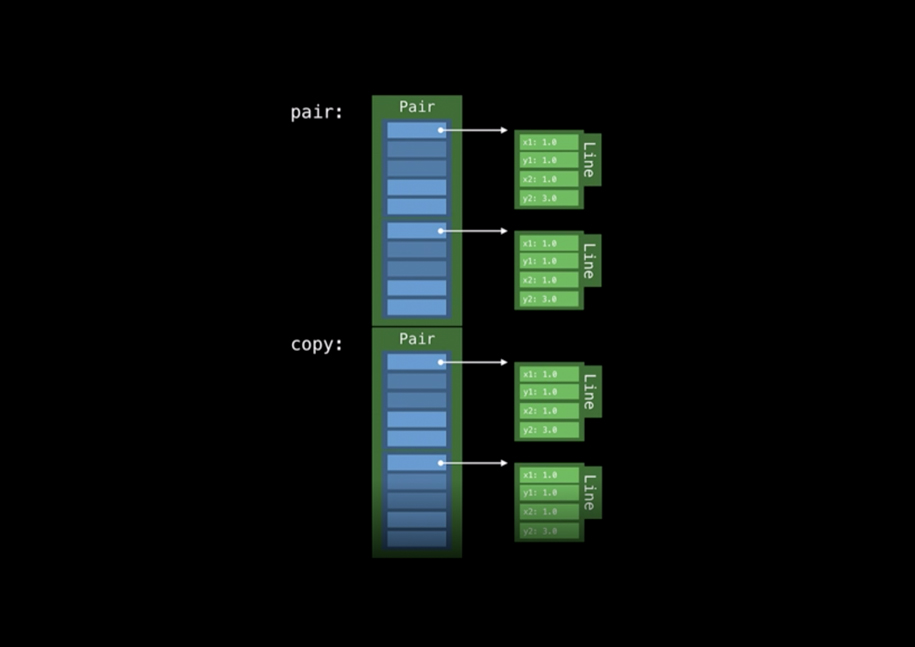
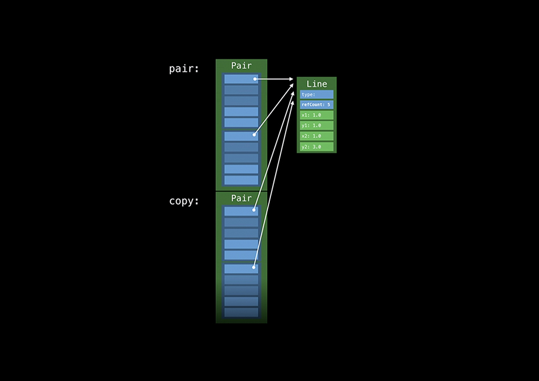
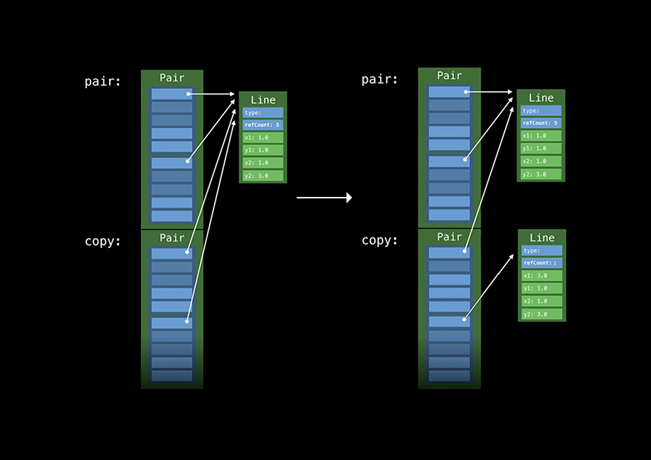

# Протокольно-Ориентированное Программирование
Разберёмся в таких темах, как Протокольные Типы и Обобщенный (Generic) код. 

## Протокольные Типы
По ходу, будут рассмотренны следующие вопросы:
+ реализация полиморфизма без наследования и ссылочных типов
+ как объекты протокольных типов хранятся и используются
+ как с ними работает Отправка Метода
	
#### Реализация полиморфизма без наследования и ссылочных типов:
```swift
https://gist.github.com/zhvrnkv/6db3762e2ff6553b6651a823781e7ab0

protocol Drawable { 
	func draw()
}

struct Point: Drawable {
    var x, y: Int
    func draw() {
        ...
    }
}

struct Line: Drawable {
    var x1, x2, y1, y2: Int
    func draw() {
        ...
    }
}

var drawbles = [Drawable]()

for d in drawbles {
    d.draw()
}
```
1. Обозначим протокол `Drawable`, который имеет метод `draw`
2. Реализуем этот протокол для `Point` и `Line` - теперь можно обращаться с ними, как с `Drawable` (вызывать метод `draw`)

Мы по прежнему имеем полиморфный код. Элемент `d` массива `drawables` имеет один интерфейс, который обозначен в протоколе `Drawable`, но имеет разные реализации своих методов, которые обозначены в `Line` и `Point`.

> Главный принцип (ad-hoc) полиморфизма: "Общий интерфейс - много реализаций"

#### Dynamic dispatch без virtual-table
Напомним, что определение корректной реализации метода при работе с классами (ссылочными типами) достигается через Динамичекую отправку и виртуальную таблицу. Виртуальная таблица есть у каждого классового типа, хранит в себе реализации его методов. Динамичекая отправка определяет реализацию метода для типа, заглядывая в его виртуальную таблицу. Все это необходимо из-за возможности наследования и переопределения методов.

В случае структур наследование, также как и переопределение методов, невозможно. Тогда, на первый взгляд, в virtual-table нет надобности, но как тогда будет работать Динамичекая отправка? Как программе понять, какой метод будет вызван на `d.draw()`? 

> Стоит отметить, что количество реализация этого метода равно количеству типов, которые соответствуют протоколу `Drawable`.

## Protocol Witness Table
- является ответом на этот вопрос
Каждый тип, который реализовал какой-либо протокол, имеет эту таблицу. Как и виртуальная таблица для классов, хранит в себе реализцаии методов, которые требует протокол.

> в дальнейшем Protocol Witness Table будет называться "протокольно-методная таблица"

Отлично, теперь мы знаем где искать реализации методов. Остается лишь **два вопроса**:
1. Как найти соответствующую протокольно-методную таблицу для того или иного объекта, который реализовал этот протокол? Как, в нашем случае, найти эту таблицу для элемента `d` массива `drawables`?
2. Элементы массива должны быть одного размера (в этом и есть суть массива). Тогда как массив `drawable` может соответствовать этому требованию, если он может хранить в себе и `Line` и `Point`, а они имеют разные размеры?

```swift
https://gist.github.com/zhvrnkv/802ce1c2f17a698612dc38214b4b8808

MemoryLayout.size(ofValue: Line(...))  // 32 bits
MemoryLayout.size(ofValue: Point(...)) // 16 bits
```

## Экзистенциальный контейнер (Existential Container)
Для решения этих двух вопросов, в Swift используется специальная схема хранения для экземпляров протокольных типов, которая называется **Экзистенциальный контейнер**. Выглядит она вот так:

| Existential Container |
|-----------------------|
| value buffer          |
| value buffer          |
| value buffer          |
| vwt                   |
| pwt                   |

Занимает 5 машинных слов (в x64 битной системе 5 * 8 = 40 бит). Разделен на три части:
1. value buffer - пространство для самого экземпляра
2. vwt - указатель на Value Witness Table
3. pwt - указатель на Protocol Witness Table

Рассмотрим все три части подробнее:

##### Буффер Содержимого (Value Buffer)
Просто три машинных слова для хранения экземпляра. Если экземпляр может уместиться в буффере содержимого, то он в нем и хранится. Если экземпляр больше 3 машинных слов, то он не поместится в буфере и программа вынуждена выделить память на куче, сложить туда экземпляр, а в буффер содержимого положить указатель на эту память. Рассмотрим на примере:
```swift
https://gist.github.com/zhvrnkv/a121eb43d2b35b534a95bd0e7b335449

let point: Drawable = Point(...)
```
`Point()` занимает 2 машинных слова и прекрасно поместится в value buffer - программа сложит его туда: 

| Existential Container |
|--------------|
| x: Int       |
| y: Int       |
| -            |
| vwt          |
| pwt          |

```swift
https://gist.github.com/zhvrnkv/865cde045e99e8b2aa26660b1410af5e

let line: Drawable = Line(...)
```
`Line()` занимает 4 машинных слова и не может поместиться в value buffer - программа выделит для нее память на хипе, а в value buffer сложит поинтер на эту память:

| Existential Container |
|--------------|
| ptr: Pointer |
| -            |
| -            |
| vwt          |
| pwt          |

`ptr` указывает на экземпляр `Line()`, размещенный на куче:

| heap memory |
|-------------|
|    -        |
|    -        |
| x1: Int     |
| y1: Int     |
| x2: Int     |
| y2: Int     |
					
					
##### Таблица жизненного цикла (Value Witness Table)
Также как и протокольно-методная таблица, эта таблица есть у каждого типа, который соответствует протоколу. Содержит в себе реализцию четырех методов: allocate, copy, destruct, deallocate. Этими методами управляется весь жизненный цикл объекта. Рассмотрим на примере:
1. При создании объекта (`Point(...) as Drawable`) вызывается метод `allocate` из Т.Ж.Ц. этого объекта. Метод allocate решит где должно быть размещенно содержимое объекта (в буффере значений или на куче) и если он должен быть размещен на куче, то выделит необходимое количество памяти
2. Метод `copy` поместит содержимое объекта в соответствующее место
3. После окончания работы с объектом вызовется метод `destruct`, который убавит все счетчики ссылок, если таковые имеются
4. После `destruct` будет вызван метод `deallocate`, который освободит выделенную на хипе память, если таковая имеется

##### Протокольно-Методная таблица (Protocol Witness Table)
Как было описанно выше, содержит в себе реализации требуемых протоколом методов для типа, к которому эта таблица привязана.

##### Экзистенциальный контейнер - Ответы
Таким образом мы ответили на поставленные два вопроса:
1. Протокольно-методная таблица хранится в Экзистенциальный контейнере этого объекта и может быть без труда из него получена
2. Если тип элемента массива является протоколом, то любой элемент этого массива занимает фиксирвоанное значение в 5 машинных слов - именно столько необходимо для Экзистенциального контейнера. Если содержимое элемента не может быть помещено в буффер значений, то он будет размещен на куче. Если может, то все содержимое будет размещенно в буффере значений. В любом случае мы получим, что размер объекта с типом протокола равен 5 машинным словам (40 бит), а из этого следует, что все элементы массива будут иметь одинаковый размер
```swift
https://gist.github.com/zhvrnkv/6063de4b6f4074c8413d11b1f833b7a2

let line: Drawable = Line(...)
MemoryLayout.size(ofValue: line) // 40 бит

let drawables: [Drawable] = [Line(...), Point(...), Line(...)]
MemoryLayout.size(ofValue: drawables._content) // 120 бит
```


##### Экзистенциальный контейнер - Пример
Рассмсотрим поведение экзистенциального контейнера в этом коде:
```swift
https://gist.github.com/zhvrnkv/b341d9cdde3695ca0fcf2d41a1c221d9

func drawACopy(local: Drawable) {
	local.draw()
}
let val: Drawable = Line(...)
drawACopy(val)
```

Экзистенциальный контейнер можно представить вот так:
```swift
https://gist.github.com/zhvrnkv/d9d89de1ee2798a90ed6ee756dae2f2c

struct ExistContDrawable {
	var valueBuffer: (Int, Int, Int)
	var vwt: ValueWitnessTable
	var pwt: ProtocolWitnessTable
}
```

**Псевдо код**
За кулисами функция `drawACopy` принимает в себя `ExistContDrawable`:
```swift
https://gist.github.com/zhvrnkv/481955c317a25854ad45a8eae04783b9

func drawACopy(val: ExistContDrawable) {
	...
}
```

Параметр функции создается вручную: создаем контейнер, заполняем его поля из полученного аргумента:
```swift
https://gist.github.com/zhvrnkv/6a36cf3ad1d9f944fe62efc964b00677

func drawACopy(val: ExistContDrawable) {
	var local = ExistContDrawable()
	let vwt = val.vwt
	let pwt = val.pwt
	local.type = type
	local.pwt = pwt
	...
}
```
Решаем где будет хранится содержимое (в буффере или хипе). Вызываем `vwt.allocate` и `vwt.copy` чтобы заполнить `local` содержимым `val`:
```swift
https://gist.github.com/zhvrnkv/057cbd6d1efec1c0a633e2c5dfdc2a26

func drawACopy(val: ExistContDrawable) {
	...
	vwt.allocateBufferAndCopy(&local, val)
}
```

Вызываем метод `draw` и передаем ему указатель на `self` (`projectBuffer` метод решит где расположен `self` - в буфере или на куче - и вернет верный указатель):
```swift
https://gist.github.com/zhvrnkv/14a506625a48e2dc470ff081217f0f39

func drawACopy(val: ExistContDrawable) {
	...
	pwt.draw(vwt.projectBuffer(&local))
}
```

Завершаем работу с `local`. Чистим все ссылки на хип от `local`. Функция возвращает значение - чистим всю память, выделенную для работы `drawACopy` (стэковый кадр):
```swift
https://gist.github.com/zhvrnkv/93995bda089a31450cc9bfe7a03c339c

func drawACopy(val: ExistContDrawable) {
	...
	vwt.destructAndDeallocateBuffer(&local)
}
```

##### Экзистенциальный контейнер - Цель
Пользование экзестенциальным контейнером требует много работы - пример выше подтвердил это -, но зачем это вообще нужно, какова цель? Цель в том, чтобы реализовать полиморфизм при помощи протоколов и типов, которые их реализуют. В ООП мы используем абстрактые классы и наследуемся от них переопределяя методы. В ПОП мы используем протоколы и реализуем их требования. Опять таки, даже с протоколами, реализация полиморфизма - это большая и энергозатратная работа. Поэтому для избежания "лишней" работы нужно понимать когда  полиморфизм нужен, а когда нет. 

Полиморфизм в реализации ПОП выигрывает в том, что используя структуры мы не нуждаемся в постоянном подсчете ссылок, отсутствует классовое наследование. Да, все очень схоже, классы, для определения реализации метода, используют виртуальную таблицу, протоколы используют протокольно-методную. Классы размещены на куче, структуры тоже иногда могут быть размещены там. Но проблема в том, что на размещенный на куче класс может быть направлено сколько угодно ссылок и подсчет ссылок необходим, а на размещенную на куче структуры только один и хранится он в экзестенциальном контейнере.

В самом деле важно отметить, что структура, которая хранится в экзистенциальном контейнере, сохранит семантику типов значений вне зависимости от того, куда она будет помещена - на стэк или кучу. За сохранение семантики отвечает Таблица Жизненного Цикла так как в нем описаны определяющие семантику методы.

##### Экзистенциальный контейнер - Хранимые свойства
Мы рассмотрели как переменная протокольного типа передается и используется функцией. Рассмотрим как такие переменные хранятся:
```swift
https://gist.github.com/zhvrnkv/cc827a157577fa744e0c451d5d1117ae

struct Pair {
    init(_ f: Drawable, _ s: Drawable) {
        first = f 
		second = s
    }
    var first: Drawable
	var second: Drawable
}

var pair = Pair(Line(), Point())
```

Каким образом хранятся эти две структуры типа `Drawable` внутри структуры `Pair`? Что представляет из себя содержимое `pair`? Оно представляет из себя два э.контейнера - один для `first`, другой для `second`. `Line` не может поместится в буффере и размещена на куче. `Point` поместился в буффере. Также это позволяет структуре `Pair` хранить объекты разного размера:
```swift
https://gist.github.com/zhvrnkv/713cd5d68446bd9785b2bd94ffac2d4e

pair.second = Line()
```
Теперь и содержимое second размещено на куче, так как не поместилось в буффер. Рассмотрим к чему это может привести:
```swift
https://gist.github.com/zhvrnkv/1bcbc0c49ec7178bdfbc047a2464f9f7

let aLine = Line(...)
let pair = Pair(aLine, aLine)
let copy = pair
```
После выполнения этого кода програма получит следющее состояние памяти:


Мы имеем 4 выделения памяти на куче, что не есть хорошо. Попробуем исправить:
1. Создадим класс-аналог `Line`
```swift
https://gist.github.com/zhvrnkv/1628fde4a8aa155c1eaf059e331a5e00

class LineStorage: Drawable {
	var x1, y1, x2, y2: Double 
	func draw() {}
}
```
2. Используем его в `Pair`
```swift
https://gist.github.com/zhvrnkv/45e540e46b7f194efb1b846e949c5494

let lineStorage = LineStorage(...)
let pair = Pair(lineStorage, lineStorage)
let copy = pair
```

Получаем одно размещение на куче и 4 указателя на него:


Но мы имеем дело с ссылочным поведением. Изменение `copy.first` отразится на `pair.first` (то же самое для `.second`), а это не всегда то, что мы хотим.

##### Косвенное хранение и копирование при изменении (copy-on-write)
До этого было упомянуто, что `String` это copy-on-write структура (хранит свое содержимое на куче и копирует его при изменении). Рассмотрим как можно реализовать свою структуру, которая копируется при изменении:
```swift
https://gist.github.com/zhvrnkv/5739519ff84b6e72c8ebcfb88fbb2542

struct BetterLine: Drawable {
    private var storage: LineStorage
    init() {
        storage = LineStorage((0, 0), (10, 10))
    }
    func draw() -> Double { ... }
    mutating func move() {
        if !isKnownUniquelyReferenced(&storage) {
            storage = LineStorage(self.storage)
        }
        // изменения в storage
    }
}
```

1. Все свойства `BetterLine` хранит в `storage`, а `storage` является классом и хранится на куче
2. Изменять `storage` можно только методом `move`. В нем мы проверяем, что на `storage` указывает только один указатель. Если указателей больше, то этот `BetterLine` делит с кем-то `storage`, а для того, чтобы `BetterLine` полностью вел себя как структура, `storage` должен быть индвидуальным - делаем копию и в дальнейшем работаем с ней.

Посмотрим как это работает в памяти:
```swift
https://gist.github.com/zhvrnkv/d237a36260a79f0223a907480ba84cab

let aLine = BetterLine()
let pair = Pair(aLine, aLine)
let copy = pair
```
1. После выполнения кода выше имеем данное состояние памяти:


2. После изменения `copy.second` (`copy.second.x1 = 3.0`) получим:


Иными словами мы имеем два экземпляра `Pair` которые делят между собой один `storage: LineStorage`. При изменении `storage` в одном из его пользователей (first/second) будет создана отдельная копия `storage` для этого пользователя, чтобы его изменение не сказались на других. Это решает проблему нарушение  семантики типов значений из прошлого примера 

### Протокольные Типы - Итог
1. ***Маленькие значения***
Если мы работаем с объектами, которые занимают мало памяти и могут быть помещены в буффер э.контейнера, то:
 + не будет размещение на куче
 + нет подсчета ссылок
 + Полиморфизм (Динамическая отправка) при помощи протокольной таблицы
 
2. ***Большие значение***
Если мы работаем с объектами, которые не помещаются в буффер, то:
 + размещения на куче
 + подсчет ссылок, если объекты содержат ссылки

> Механизм использования перезаписи на изменение и косвенного хранения были продемонстрированы и могут значительно улучшить ситуацию с подсчетом ссылок в случае большого количества ссылок

Мы выяснили, что протокольные типы, также как и классы, способны реализовать полиморфизм. Происходит это при помощи хранения в экзистенциальном контейнере и использования протокольных таблиц - жизненного цикла и протокольно-мутодная
